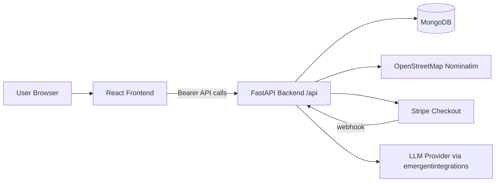
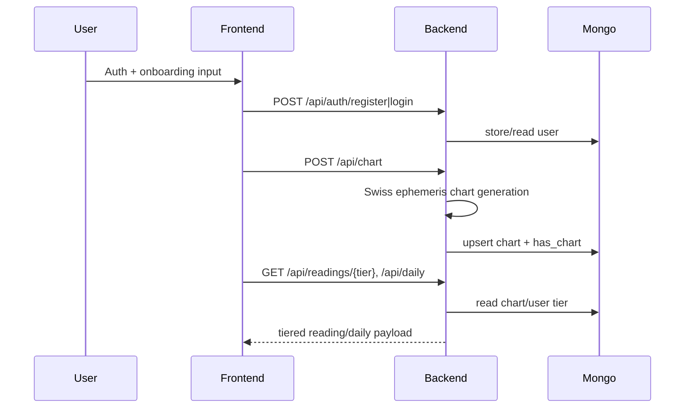
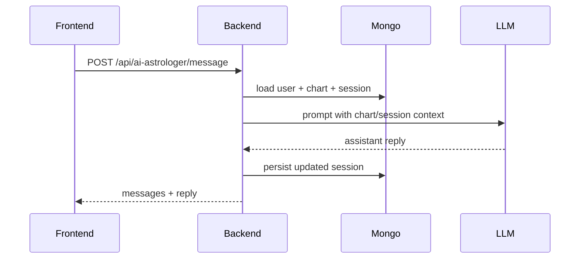

# Architecture Overview

This page summarizes the verified runtime architecture for Ephemeral.

**Who this page is for:** Developers, architects, maintainers.

## System architecture

- Frontend: React (Create React App + CRACO) in `/frontend`
- Backend: FastAPI service in `/backend/server.py`
- Database: MongoDB via Motor (async)
- External services: OpenStreetMap Nominatim, Stripe Checkout, LLM API via emergentintegrations

## High-level diagram

## Core request/data flow

## AI Astrologer flow

## Related pages

- [Codebase Structure](./codebase-structure.md)
- [Backend API Reference](../reference/api-reference.md)
- [Runtime and Operations](../operations/runtime-operations.md)
